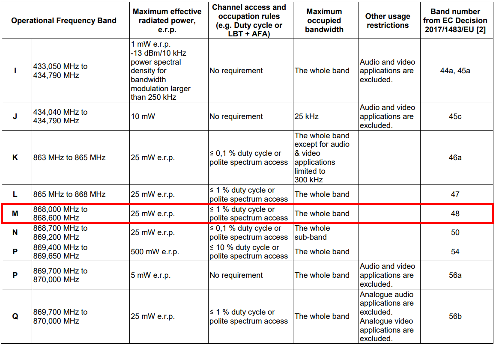
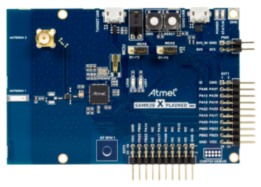
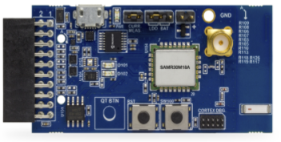
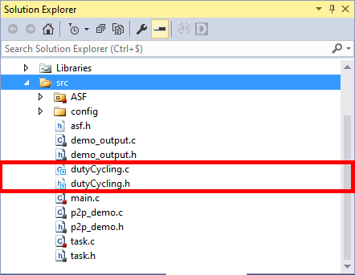
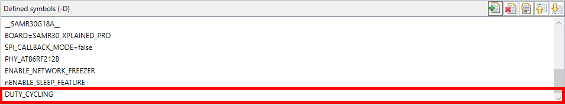
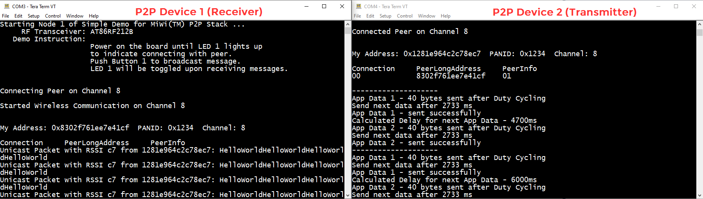
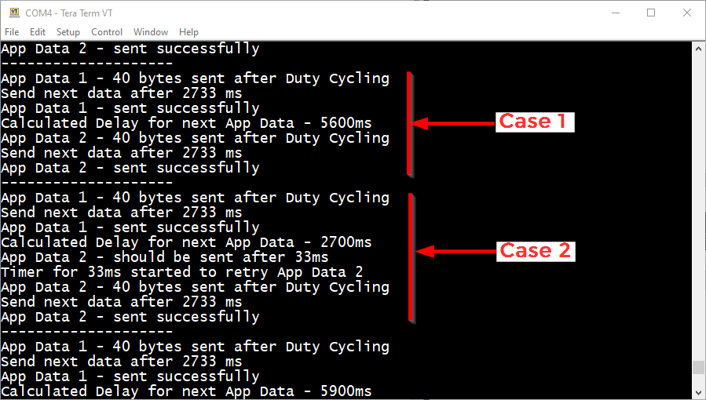

# ATSAMR30_MIWI_P2P_DUTY_CYCLE

> "Wireless Made Easy!" - Enable Duty Cycling Regulation features on SAM R30 MiWi P2P Simple Application

Devices: | **ATSAMR30 | ATSAMR30M**

## ⚠ Disclaimer

<b>
THE SOFTWARE ARE PROVIDED "AS IS" AND GIVE A PATH FOR SELF-SUPPORT AND SELF-MAINTENANCE.  
This repository contains unsupported example code intended to help accelerate client product development. It is not validated for production nor audited for security best-practices.  
Note that while this repository is unsupported, Microchip welcome community contributions, and all pull-requests will be considered for inclusion into the repository.

</b>

> Interact with your peers about this software in [MiWi Forum](https://www.microchip.com/forums/f507.aspx).

## Abstract

Enable Duty Cycling Regulation features on SAM R30 MiWi P2P Simple Application.

## Resources

- [ATSAM R30 Family Landing page](https://www.microchip.com/design-centers/wireless-connectivity/zigbee-solutions/hardware/sam-r30)
- [MiWi Software Design Guide](https://ww1.microchip.com/downloads/en/DeviceDoc/MiWi-Software-Design-Guide-User-Guide-DS50002851B.pdf)
- [MiWi Quick Start Guide](https://ww1.microchip.com/downloads/en/DeviceDoc/MiWi-Quick-Start-Guide-User-Guide-DS50002850B.pdf)

## A la carte

1. [Introduction](#step1)
1. [Supported Hardware Platforms](#step2)
1. [Software Requirements](#step3)
1. [Sample Applications](#step4)
1. [Duty Cycling APIs](#step5)
1. [Run the Demo](#step6)
1. [Limitations](#step7)

## Introduction

The duty cycling is a limitation in the Sub-GHz band. 

Duty cycle is defined as the ratio, expressed as a percentage, of a maximum transmitter "on" time within a 1 hour period.

Europe (863-870 MHz frequency band), Russia (864-870MHz band) and Asia (923 MHz band) are regions where duty cycle regulation is applied.

<!--For Europe region, the ETSI regulations allow the choice of using either a duty-cycle limitation or a so-called Listen Before Talk Adaptive Frequency Agility (LBT AFA) transmissions management. 
-->
For Europe region, the ETSI regulation allows the choice of using either a duty-cycle limitation mechanism or a polite spectrum access. The polite spectrum access encompasses 2 aspects: Listen Before Talk (LBT) and Adaptive Frequency Agility (AFA).

The duty cycle of radio devices is often regulated by government. Depending of the region and the frequency radio band, but the duty cycle value can be 0.1%, 1% or 10%.

In Europe, duty cycles are regulated in the [ETSI EN 300 220-2 v3.2.1 (2018-06) standard](https://www.etsi.org/deliver/etsi_en/300200_300299/30022002/03.02.01_60/en_30022002v030201p.pdf). This standards defines the following sub-bands and their duty cycle values:

- g (863.0 – 868.0 MHz): 1% 25mW (14dBm)
- g1 (868.0 – 868.6 MHz): 1% 25mW (14dBm)
- g2 (868.7 – 869.2 MHz): 0.1% 25mW (14dBm)
- g3 (869.4 – 869.65 MHz): 10% 500mW (27dBm)
- g4 (869.7 – 870.0 MHz): 1% 25mW (14dBm)

To match the local regulations, the end device transmit duty-cycle SHALL be lower than the x% of a particular sub-band. That means the end device cannot occupy the selected band more than a certain amount of time. The duty-cycle is also here to avoid network congestion.

Every radio device must comply with the regulated duty cycle limits. The duty cycle at the operating frequency shall not be greater than regulated values for the chosen operational frequency band. And this is true either the radio is using frequency hopping mechanism or not.

SAM R30 device being a IEEE 802.15.4 device, it operates in the g1 868-868.6 MHz band and the corresponding duty cycle limit as per [ETSI EN 300 220-2 v3.2.1 (2018-06) standard](https://www.etsi.org/deliver/etsi_en/300200_300299/30022002/03.02.01_60/en_30022002v030201p.pdf) is 1%. So, in this case the duty cycle is 1% of the time per hour (36 seconds). The cumulative transmissions time for the SAM R30 cannot exceed 36 seconds within an hour.

By default, MiWi stack does not implement the duty cycle mechanism but MiWi protocol implements the Listen-before-talk, a “polite” communication protocol which scans the channel for activity before initiating a transmission. MiWi protocol does not support Frequency-Hopping Systems and operates on a single channel.

According the [SAM R30 Module EU-RED Certification document](http://ww1.microchip.com/downloads/en/DeviceDoc/ATSAMR30M18A%20Europe%20Certification%20Reports%20(CE%20RED).zip), no "polite spectrum access" has been tested.

For SAM R30 Module, we demonstrated duty cycle limits with the help of [Wireless Performance analyzer tool](https://onlinedocs.microchip.com/pr/GUID-16A6E967-ABB5-42D8-BBED-6F0DBB16B126-en-US-1/index.html) where we limit the number of packets transmitted in a given duration. This can be found under [Section 5.1.7 Duty cycle of 50176781 001 (EN 300 220 Test Report For ATSAMR30M18A)](http://ww1.microchip.com/downloads/en/DeviceDoc/ATSAMR30M18A%20Europe%20Certification%20Reports%20(CE%20RED).zip).

**The sample application code can help to ensure the data transmitted out of the node is limited and meets duty cycle limits (<1%) in the g1 868-868.6 MHz band.**

## Supported Hardware Platforms

- [ATSAMR30 5x5mm IC](https://www.microchip.com/ATSAMR30E18A)
- [ATSAMR30 7x7mm IC](https://www.microchip.com/ATSAMR30G18A)
- [ATSAMR30M Module](https://www.microchip.com/wwwproducts/en/ATSAMR30M18)
  

- [SAMR30 Xplained Pro](https://www.microchip.com/DevelopmentTools/ProductDetails/ATSAMR30-XPRO)

> SAMR30 Xplained Pro can be programmed using on-board EDBG component using Microchip Studio over the EDBG USB connector. This single EDBG USB connector can be used for powering, programming the board and serial console messages.

- [SAMR30M Xplained Pro](https://www.microchip.com/DevelopmentTools/ProductDetails/ac164159)

> SAMR30M Xplained Pro can be programmed using an external programming tool (ATMEL-ICE or SAM-ICE) over the CORTEX DBG connector . In Device Programming menu from Microchip Studio, make sure to select ATSAMR30E18A device with SWD interface, read the device signature and target voltage and finally enter 0x7 in the USER_WORD_0.NVMCTRL_BOOTPROT and program Fuses prior to program memory with .elf file.\
Checkout section 2.1.3 of [SAMR30 Module Xplained Pro User's Guide](https://ww1.microchip.com/downloads/en/DeviceDoc/50002827A.pdf)

## Software Requirements

- Download and install [Microchip Studio 7.0 IDE](https://www.microchip.com/mplab/microchip-studio).
- Open Microchip Studio 7.0 IDE.
- From **Tools - > Extensions and updates**, install Advanced Software Framework (ASFv3) v3.49.1 release or upper release.
- Restart Microchip Studio

- Download and install a serial terminal program like [Tera Term](https://osdn.net/projects/ttssh2/releases/).

- [Clone/Download](https://docs.github.com/en/free-pro-team@latest/github/creating-cloning-and-archiving-repositories/cloning-a-repository) the current repo to get the sample applications.

## Sample Applications

The present repository contains the following sample applications:

- MiWi P2P Simple Application with Duty Cycling enabled for SAMR30 Xplained Pro (IC)
- MiWi P2P Simple Application with Duty Cycling enabled for SAMR30M Xplained Pro (Module)

**Both applications are based on MiWi P2P Simple Application and MiWi protocol stack v6.5**.
- `dutyCycling.c` and `dutyCycling.h` are the duty cycling implementation files for MiWi-P2P
- `main.c` and `task.c` have been modified for the purpose of this demo

The simple example application code focuses on the simplicity of the MiWi™ DE protocol stack application programming interfaces. It provides a clean and straightforward wireless communication between two devices with less than 30 lines of effective C code to run the stack in application layer for both devices. In this application, following features of MiWi™ DE protocol stack have been demonstrated:
* Establish connection automatically between two devices
* Broadcast a packet
* Unicast a packet
* Apply security to the transmitted packet

> Version information of the MiWi stack is defined in `miwi_api.h` file.

Duty Cycling is enabled by default in the application with `DUTY_CYCLING` macro in **Project properties -> Toolchain -> ARM/GNU C Compiler -> Symbols**

## Duty Cycling APIs

The following lists the supported APIs.

Function Prototype : `dutyCycling.h`\
Function definitions : `dutyCycling.c`

### `MiApp_DutyCyclingInit`

| API | `void MiApp_DutyCyclingInit(void)` |
| --- | --- |
| **Description** | Initializes the duty cycling timer and assigns the handler |
| **Parameters** | None |
| **Returns** | None |
| **Example** | <code>MiApp_DutyCyclingInit(void);</code> |

### `MiApp_SendDutyCycledData`

| API | `uint32_t MiApp_SendDutyCycledData(uint8_t addr_len, uint8_t *addr, uint8_t msglen, uint8_t *msgpointer, uint8_t msghandle, bool ackReq, DataConf_callback_t ConfCallback)` |
| --- | --- |
| **Description** | This function unicast a message in the msgpointer to the device with destination address using duty cycling implementation |
| **Parameters** | <code>uint8_t addr_len</code> - destionation address length <code>uint8_t *addr</code>  - destionation address <code>uint8_t msglen</code> - length of the message <code>uint8_t *msgpointer</code> - message/frame pointer <code>uint8_t msghandle</code> - message handle <code>bool ackReq</code> - set to receive network level ack (Note- Discarded for broadcast data) <code> DataConf_callback_t ConfCallback</code> - The callback routine which will be called uponthe initiated data procedure is performed |
| **Returns** | `uint32_t` - time to wait for the duty cycling to complete before transmitting current data.  `0` indicates successful transmission. |
| **Example** | <code>uint32_t timeToSend = MiApp_SendDutyCycledData(LONG_ADDR_LEN, connectionTable[0].Address, PAYLOAD_SIZE, PAYLOAD, 1, true, dutyCyclingAppData1Confcb);</code> |

## Run the Demo

Open Tera Term with serial settings: **115200 8 N 1**

The project can be programmed in two SAM R30 XPro boards.\
The board which starts first will not send any data unless the SW0 button is pressed.\
On flashing the second board, it will search and connect to first board.\
After connection, it will send two data consecutively for every 10 seconds. 

1.	Application sends out AppData1 in dutycycling mode for every 10 seconds.
2.	In the callback of AppData1, a random delay timer is started to send AppData2.
3.	In the handler of delay timer, AppData2 is sent using the `MiApp_SendDutyCycledData` API.
4.	If the random delay timer was greater than the dutycycling interval, then the data is sent; else if its less than the dutycycling interval then the duration to wait until next data is returned in the API.
5.	Based on the returned time, the AppData2 is retried and sent successfully.

After transmitting App Data 1, application is starting a timer with random interval and try to send App Data 2.

As illustrated below:
* Case-1: If the random delay is greater than the duty cycling timer then App Data 2 will be sent successfully.
* Case-2: If the random delay is less than the duty cycling timer then App data 2 will not be sent and the pending wait interval will be return by `MiApp_SendDutyCycledData` for App Data 2.

## Limitations

- In this sample application, Duty cycling has been implemented for the End Device role only
- Duty cycling is performed on applicative payload transmission from end-device to coordinator
- Duty cycling is not implemented for ACK packets
- Time on air has been calculated with size of the payload and radio parameters which are coming from the SAM R30 datasheet (checkout in `dutyCycling.h`)

[Back to top](#top)

